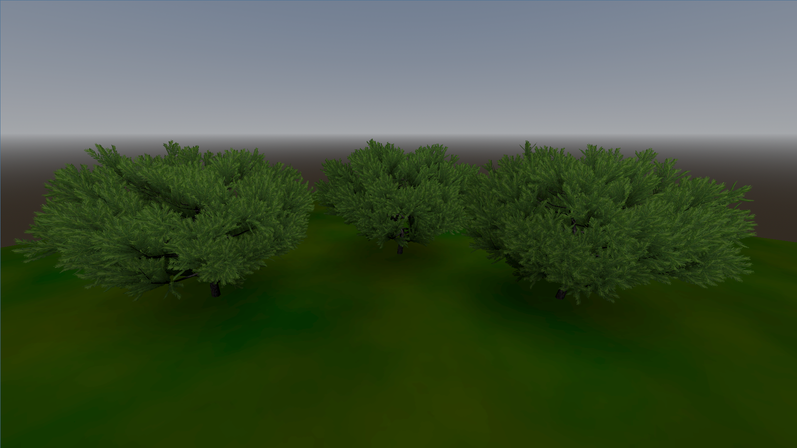
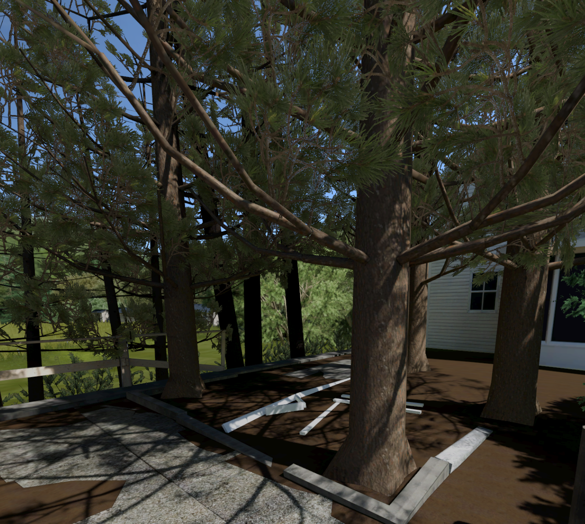

# Godot Mobile-Optimized Foliage Plugin

A 3D foliage instancing plugin designed for mobile GPUs

Creating visually pleasing yet performant trees and bushes in mobile VR is a huge challenge and, if you're working on an outdoor scene, chances are you're going to want to put some trees in it. Professionally modeled assets might come with hundreds of thousands or millions of polygons and that's just not going to work on a mobile GPU, especially if you're making a forest. Let's consider some of the common workarounds.

### Stylized trees
Low polygon count, flat toon shading, etc. These are highly performant but they look like cartoons and it means your whole project will be locked into this art style for consistency.

### Billboards
If your trees are far away, you can use a simple quad with an image of a tree on a transparent background. Don't use too many overlapping cards, though, or the overdraw will cause your FPS to suffer. Even better if you have a cluster of billboards, render them as a single large image in your DCC software and then you only need to load one texture. However, if the user is expected to get close to them, they will look really fake.

### GPU Instances
If the meshes are simple enough, you can use GPU instancing and even give them some variety in size and color, which also works well at a distance but not up close.

### Impostors
This is an interesting technique in which many lower-resolution views of the subject are captured from several perspectives and combined as a grid in a single image. The shader selects the appropriate section of the texture, depending on the camera's position relative to the object. This also only works at a distance due to the low resolution.

---

### How this plugin works

If you want the user to be able to walk near the tree and not break the immersion, then it's going to require quite a few more polygons. However, this is not as much of a deal breaker as it once was. Modern hardware like the Meta Quest can handle a suprising number of vertices. What we do need to be careful about, though, are things like texture lookups, transparency, and light and shadows. This plugin takes advantage of GPU instancing, alpha to coverage transparency, and fake lighting and shadows.

First of all, we'll start with a tree mesh that consists of just the trunk and branches. This is much simpler geometry, relative to the leaves, so it's not going to break the bank. We can also use LOD to further simplify it as the camera moves away. We can render the trunk/branch texture using Blender's Cycles engine so the light and shadow information is baked in and can skip the PBR pipeline. The branches will be less visible than the leaves, so we don't need the texture to be too high-res. With some diligent UV unwrapping, we can also devote more pixel real estate to the lower part of the trunk, which is more conspicuous than the branches. Now we can create a `MultimeshInstance3D` and scatter transparent leaf cards on the branches. I separated the trunk and branches into two meshes because leaves generally don't grow on the trunk. To make a really dense, leafy tree, it might make more sense to combine clusters of leaves on a single card and instantiate small branches rather than individual leaves. This is especially helpful with conifers, which would otherwise require a vast amount of triangles to represent their needles.

Since transparency is in use, with many overlapping quads, alpha blending is not going to cut it. We'll use [alpha to coverage](https://en.wikipedia.org/wiki/Alpha_to_coverage) instead, which is similar to alpha test (in which pixels are either fully transparent or fully opaque) but it sends the alpha channel to the multisample anti-aliasing (MSAA) process (which is cheap to use on mobile GPUs) and compares the binary `AND` of the two masks, resulting in a strict 0 or 1 value, yet with a smoother appearance due to the anti-aliasing. This setting is called "Alpha Edge Clip" in Godot's `StandardMaterial3D` and the corresponding render mode is `alpha_to_coverage_and_one` in Godot's shading language.

I'm also using the `unshaded` render mode in the leaf shader to avoid PBR overhead. To make up for this, the shader will have to fake the light and shadow. The assumption is that, being an outdoor scene, there is a single directional light source (the sun) illuminating any other objects in the scene since that's relatively cheap and we pass this light node as a parameter to the GDScript part of the plugin (`foliage_shadow.gd`). As the script scatters leaf instances on the multimesh, it calculates their position on the tree relative to the light source and stores this brightness value in the red channel of the instance's custom data, available in the shader as `INSTANCE_CUSTOM.r`. The shader will then darken the albedo based on this, approximating self-shadowing and adding some nice depth information to what would otherwise look very flat. By designing the leaf card mesh with the base of the twig at the origin and growing upward along the +Z axis in Blender (+Y in Godot coordinates), the shader can evaluate the height of the individual mesh in local space and create a shadow gradient along its length, further enhancing the depth effect.

Since the terrain in this demo is also unshaded, I created blob shadows under each shrub using a `Decal` node and a radial gradient texture. By default, decals apply to all render layers so I moved the terrain mesh to layer 2 so only it would receive the blob shadow. If I wanted sharper details, I would have instead baked the terrain texture with Cycles in Blender as I've done in one of my other projects that uses this plugin:

What we now have is a tree drawn entirely with the `unshaded` render mode that still retains some hints as to how light would interact with it. The GPU is doing the heavy lifting by rendering hundreds or thousands of leaves with a single draw call. And, best of all, the user can get right up close and view it from any angle. Use this technique for trees in the forground and put some billboards behind them (ideally where the scene prohibits the user from approaching) and you can create a reasonably convincing forest.